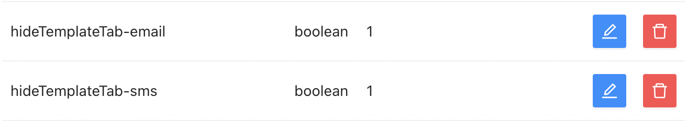

# Admin panel documentation

Coming soon more documentation on this package

In this section, you can:

- Set up global settings between instances.
- Set up settings for the admin panel.
- Set up settings for each installed package.

## User Settings

In this section, you can create your own variables that will be accessible throughout all instances. Some use cases include:

- Additional logos.
- Cookie consent message.
- Texts for all blocks.
- Texts that would appear in the header or footer.

You can easily create or update these variables. Once you press the "New" button, you need to fill in the following fields:

- Group: This field is used to group your keys (useful for frontend implementation), so all the keys are grouped under any name you need.
- Key: Unique name of your variable.
- Enumerable: Whether this value should appear in an endpoint that lists all user settings.
- Public: Whether this value is available for everyone, even anonymous users.

Next, you need to select the type of your variable:

- Text
- Markdown
- JSON
- File
- Image
- Boolean
- Number

For more sophisticated cases, you should select `JSON`. The rest of the types are self-explanatory.

## Global Settings

Global Settings are settings that have default values that you can change. They are referred to in many sections of the admin panel, such as hiding particular elements or disabling SCORM. Each key is either self-explanatory or is described by a tooltip.

## Package Settings

Each package has its own settings that you can manage from the admin panel. For example:
- From the `auth` package, you can disable registration.
- From the `auth` package, you can set up that `account_must_be_enabled_by_admin`.

This is the place where you can enable social media single sign-on, change the default currency, and so on.

## Course - Additional Settings

`boolean (default: false)` showInCourseAdditionalSettings-**public**

If you want to be able to mark course as **public**, which means **free** of charge, you need to set value of this setting to `true`. It's `false` by default, because that feature isn't use often.

-   :white_check_mark: Here's example of this setting enabled:
    

    Then, in course attributes you should see this option available:

    

## Templates - Hide tabs

`boolean (default: false)` hideTemplateTab-**email**

`boolean (default: false)` hideTemplateTab-**sms**

By default all tabs are shown.

Let's hide **email** and **sms** tabs.

Result:

