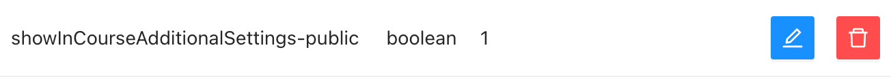

# Admin panel documentation

Coming soon more documentation on this package

## Course - Additional Settings

`boolean (default: false)` showInCourseAdditionalSettings-**public**

If you want to be able to mark course as **public**, which means **free** of charge, you need to set value of this setting to `true`. It's `false` by default, because that feature isn't use often.

-   :white_check_mark: Here's example of this setting enabled:
    

    Then, in course attributes you should see this option available:

    

## Templates - Hide tabs

`boolean (default: false)` hideTemplateTab-**email**

`boolean (default: false)` hideTemplateTab-**sms**

By default all tabs are shown.

Let's hide **email** and **sms** tabs.

Result:

